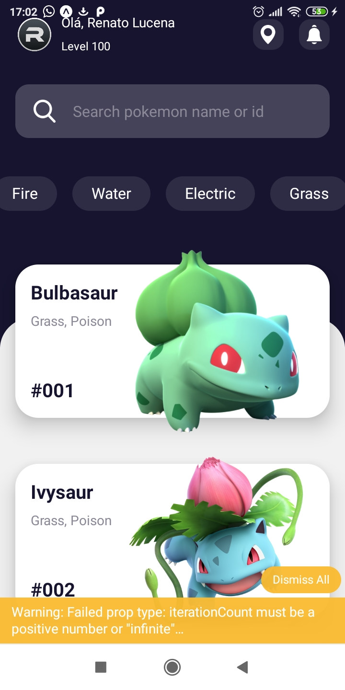

# Pokemon 

<h1 align="center">
	
</h1>

<h3 align="center">
  Projeto ReactNative - Pokemon
</h3>

- expo 36
- react-native

1. A partir da raiz do projeto, entre na pasta do frontend web rodando `cd frontend`;
2. Rode `yarn` para instalar as dependências;
3. Rode `yarn start` para iniciar o client. OR `expo r -c`

Open the `App.js` file to start writing some code. You can preview the changes directly on your phone or tablet by clicking the **Run** button or use the simulator by clicking **Tap to Play**. When you're done, click **Save** and share the link!

When you're ready to see everything that Expo provides (or if you want to use your own editor) you can **Export** your project and use it with [expo-cli](https://docs.expo.io/versions/latest/introduction/installation.html).

If you're having problems, you can tweet to us [@expo](https://twitter.com/expo) or ask in our [forums](https://forums.expo.io).
##  Sample Snack app
Snack is Open Source. You can find the code on the [GitHub repo](https://github.com/expo/snack-web).

- Renato Lucena
- @cpdrenato
